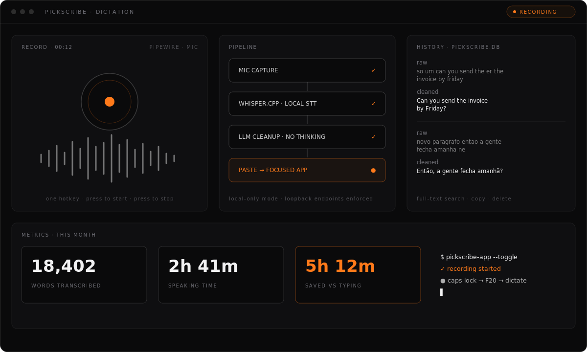

<p align="center">
  
</p>

# PickScribe

Local Linux dictation with AI cleanup. PickScribe records your microphone, transcribes speech locally with `whisper.cpp`, cleans the transcript with an OpenAI-compatible LLM provider, and pastes the final text into the focused app — one hotkey to start, the same hotkey to stop.

```text
Shortcut
  -> record microphone
  -> local whisper.cpp speech-to-text
  -> DeepSeek V4 Flash cleanup with thinking disabled
  -> clipboard + paste hotkey into the focused field
```

Local-first. Open source. Built for people who ship.

PickForge builds the app. PickScribe lets you dictate into it — or any other app — instead of typing.

> **Status:** Linux ships first: CachyOS/Arch + KDE/Wayland are the primary target, with `.deb` and AppImage bundles. macOS and Windows remain blocked until native audio capture, paste automation, global shortcuts, tray/window validation, signing, and native-host smoke tests land.

## The desktop app

The repo ships **PickScribe.app**, a Tauri 2 + Svelte 5 desktop app (same stack as PickGauge) that wraps the whole pipeline:

- **Dashboard** — record orb, live waveform, recording timer, and metrics: words transcribed, speaking time, sessions, and estimated time saved vs typing (baseline WPM is configurable).
- **History** — every transcription stored locally in SQLite (`~/.local/share/pickscribe/pickscribe.db`), with both the raw whisper transcript and the cleaned text, full-text search, copy, and delete.
- **Floating button** — a draggable always-on-top capsule that shows the live waveform while recording. Click it to open the app, right-click to toggle dictation. It never takes keyboard focus, so pasting still lands in your app.
- **Sounds, not notifications** — short synthesized chimes on record start/stop/error (toggle in Settings).
- **Tray** — left-click toggles dictation; the icon switches between idle and recording states.
- **Settings** — system check (doctor), whisper model/language, cleanup provider + instructions, paste method/chord/delay, autostart, floating button, sounds.
- **Local-only mode** — one switch that guarantees no text leaves the machine: only loopback cleanup endpoints (Ollama, LM Studio, llama.cpp server…) are allowed, remote providers are blocked and fall back to the raw transcript.
- **Bring your own provider** — besides DeepSeek/OpenAI/Ollama there is a custom OpenAI-compatible provider (OpenRouter, OpenCode, vLLM…): point it at any `/chat/completions` URL with your own key, then hit "Fetch models" to pick from the provider's `/models` route — or just type the model name.

<p align="center">
  
</p>

Bind your global shortcut (e.g. remapped Caps Lock → F13) to:

```bash
pickscribe-app --toggle
```

The single-instance plugin forwards `--toggle` to the running app, so the same command starts the app when needed. Existing shortcuts pointing at the legacy wrappers keep working: `pickscribe-gui` and `pickscribe-terminal-gui` automatically forward to the desktop app when it is installed (the terminal variant passes `--paste-chord=ctrl-shift-v`), falling back to the CLI flow otherwise (`PICKSCRIBE_FORCE_CLI=1` forces the CLI). The CLI binaries keep working unchanged; the app reads the same `~/.config/pickscribe/env` for API keys and stores its own settings in `~/.config/pickscribe/config.toml`.

On Wayland the app runs natively (smooth WebKitGTK scrolling). The floating button stays on top through a KWin window rule that PickScribe installs automatically on KDE (forcing keep-above, no-focus, and skip-taskbar for the capsule). On Wayland compositors without window rules, set `PICKSCRIBE_X11=1` to fall back to XWayland keep-above.

## Current behavior

- Toggle recording with one command: press once to start, press again to stop.
- Transcribes locally with `whisper.cpp` and a multilingual model.
- Supports English and Portuguese; Portuguese cleanup is instructed to use Brazilian Portuguese.
- Cleans text through the official DeepSeek API using `deepseek-v4-flash`.
- Sends `thinking: { "type": "disabled" }` for low-latency cleanup.
- Copies the cleaned text to clipboard and pastes with `Ctrl+V` by default.
- Keeps old MVP aliases (`voice-flow`, `voice-cleanup`) for compatibility, but the app name is PickScribe.

## Install

**Quick install** (Linux AppImage with FUSE fallback, no sudo):

```sh
curl -fsSL https://pickforge.dev/pickscribe/install.sh | sh
```

Installs the latest [release](https://github.com/pickforge/pickscribe/releases) AppImage into your home, adds an app-menu launcher, and falls back automatically on FUSE3-only systems. The dictation engine (whisper.cpp, ydotool paste automation) is set up by building from source below.

Download the latest `.deb` or `.AppImage` from [Releases](https://github.com/pickforge/pickscribe/releases/latest). PickScribe ships Linux only for now: install the `.deb` with your package manager, or `chmod +x` the `.AppImage` and run it. Updates arrive through the in-app updater.

### From source

Install system dependencies on Arch/CachyOS:

```bash
sudo pacman -S --needed rust cargo git cmake ninja ffmpeg pipewire-audio wl-clipboard ydotool gst-plugins-good
```

Enable `ydotool` for Wayland paste automation:

```bash
sudo usermod -aG input "$USER"
systemctl --user enable --now ydotool.service
```

Log out and back in after changing groups.

Build and install PickScribe:

```bash
cargo build --release --bins
mkdir -p ~/.local/bin
cp target/release/pickscribe target/release/pickscribe-cleanup ~/.local/bin/
cp scripts/pickscribe-env.sh scripts/pickscribe-gui scripts/pickscribe-terminal-gui scripts/pickscribe-cleanup-gui ~/.local/bin/
cp scripts/voice-flow scripts/voice-cleanup scripts/voice-flow-gui scripts/voice-cleanup-gui scripts/install-whisper-cpp-local ~/.local/bin/
chmod +x ~/.local/bin/pickscribe* ~/.local/bin/voice-flow ~/.local/bin/voice-cleanup ~/.local/bin/voice-flow-gui ~/.local/bin/voice-cleanup-gui ~/.local/bin/install-whisper-cpp-local
```

Install/update local `whisper.cpp` and the multilingual `base` model:

```bash
install-whisper-cpp-local
```

## DeepSeek setup

Create the GUI-safe config file:

```bash
mkdir -p ~/.config/pickscribe
chmod 700 ~/.config/pickscribe
nano ~/.config/pickscribe/env
chmod 600 ~/.config/pickscribe/env
```

Recommended contents:

```bash
DEEPSEEK_API_KEY="your_api_key_here"

PICKSCRIBE_PROVIDER="deepseek"
PICKSCRIBE_MODEL="deepseek-v4-flash"
PICKSCRIBE_ENDPOINT="https://api.deepseek.com/v1/chat/completions"
PICKSCRIBE_DEEPSEEK_THINKING="disabled"

PICKSCRIBE_LANGUAGE="auto"
PICKSCRIBE_WHISPER_MODEL="$HOME/.local/share/whisper.cpp/models/ggml-base.bin"
PICKSCRIBE_WHISPER_MODEL_NAME="base"

PICKSCRIBE_PASTE_METHOD="hotkey"
PICKSCRIBE_PASTE_CHORD="ctrl-v"
PICKSCRIBE_PASTE_DELAY_MS="250"

PICKSCRIBE_AUTO_UPDATE_WHISPER="check"
PICKSCRIBE_UPDATE_INTERVAL_HOURS="168"
```

`deepseek-v4-flash` is the recommended model for dictation cleanup. PickScribe disables DeepSeek thinking/reasoning mode because cleanup should be fast and concise.

## Testing

Safe terminal test with no paste:

```bash
pickscribe-gui start --no-notify
# speak
pickscribe-gui stop --stdout-only --no-notify
```

Copy-only test:

```bash
pickscribe-gui start --no-notify
# speak
pickscribe-gui stop --no-paste --print --no-notify
```

Normal use from a shortcut:

```bash
pickscribe-gui
# speak
pickscribe-gui
```

Do not use the normal paste flow from a terminal unless you intentionally want the final text pasted back into that terminal. The normal flow pastes into whichever app is focused.

## Recommended hotkey

### Practical default

Use:

```text
Ctrl + Alt + Space
```

Bind it to:

```bash
/home/dev/.local/bin/pickscribe-gui
```

KDE path:

```text
System Settings -> Keyboard -> Shortcuts -> Add New -> Command or Script
```

### Best long-term hotkey: Caps Lock remapped to F13/F20

If you want Caps Lock as the PickScribe key, do **not** bind raw Caps Lock directly while it still toggles capitalization. Instead, remap Caps Lock to a harmless key such as `F13` or `F20`, then bind that key to PickScribe.

Why this avoids conflicts:

- Caps Lock no longer toggles uppercase.
- Apps see a dedicated unused function key instead of Caps Lock.
- KDE binds the remapped key to PickScribe normally.

Recommended future setup:

```text
Caps Lock -> F20 -> /home/dev/.local/bin/pickscribe-gui
```

A robust Wayland-friendly way to do this is a low-level remapper such as `keyd` or `input-remapper`. Once remapped, assign the resulting F13/F20 key in KDE Shortcuts.

## Terminal paste behavior

Most GUI apps paste with:

```text
Ctrl + V
```

Most Linux terminals paste with:

```text
Ctrl + Shift + V
```

PickScribe defaults to `Ctrl+V` because normal text fields are the main target:

```bash
PICKSCRIBE_PASTE_CHORD="ctrl-v"
```

For terminal-focused dictation, create a second KDE shortcut named `PickScribe Terminal` with this command:

```bash
/home/dev/.local/bin/pickscribe-terminal-gui
```

You can also temporarily run:

```bash
PICKSCRIBE_PASTE_CHORD="ctrl-shift-v" pickscribe-gui
```

Automatic terminal detection is planned, but KDE/Wayland does not expose the active native window class through simple `xdotool` in this setup.

## Updating local whisper.cpp

Because the recommended setup builds `whisper.cpp` under `~/.local/src`, pacman/yay will not update it automatically.

Check for updates:

```bash
pickscribe-gui check-whisper
```

Update/rebuild whisper.cpp and relink `~/.local/bin/whisper-cli`:

```bash
pickscribe-gui update-whisper
```

Safe automatic update checks are enabled with:

```bash
PICKSCRIBE_AUTO_UPDATE_WHISPER="check"
PICKSCRIBE_UPDATE_INTERVAL_HOURS="168"
```

Use `install` instead of `check` only if you want the first recording after an upstream update to pull/rebuild automatically.

## CLI reference

Main flow:

```bash
pickscribe --help
pickscribe start
pickscribe stop --stdout-only
pickscribe cancel
pickscribe check-whisper
pickscribe update-whisper
```

Opt-in incremental CLI transcription keeps the current final cleanup/paste flow,
but lets the background worker prepare local transcript segments while recording:

```bash
pickscribe start --incremental
pickscribe stop --stdout-only
PICKSCRIBE_INCREMENTAL_DICTATION=1 pickscribe start
```

Cleanup helper:

```bash
pickscribe-cleanup --help
echo "hello this needs punctuation" | pickscribe-cleanup --stdout-only
```

Legacy aliases remain available during the MVP:

```bash
voice-flow-gui
voice-cleanup-gui
voice-flow
voice-cleanup
```

## Branding

Canonical PickScribe brand assets live in `assets/branding/`. The set follows the Pickforge Studio v2 system: dark canvas, off-white bracket mark, waveform motif, and ember accent.

- `pickscribe-app-icon.svg` and `pickscribe-app-icon-{32,64,128,256,512,1024}.png` for package/app icons.
- `src-tauri/icons/icon.icns`, `src-tauri/icons/icon.ico`, and the generated PNG/AppX exports for Tauri bundle icons.
- `pickscribe-tray-idle.svg`, `pickscribe-tray-recording.svg`, and PNG exports for future tray states.
- `pickscribe-lockup-horizontal.svg`, `pickscribe-wordmark.svg`, `pickscribe-og-image.png`, and `pickscribe-hero-art.png` for docs, social cards, and marketing surfaces.

## Privacy and security

- Audio never leaves your machine. Recordings are transcribed locally with `whisper.cpp` and are never uploaded.
- Cleanup sends text, never audio. When LLM cleanup is enabled, the transcribed text is sent to the configured LLM endpoint — DeepSeek by default — for the cleanup step, and nothing else.
- Incremental mode writes partial transcripts only to the local runtime state directory while recording, then removes them on stop/cancel unless audio retention is enabled.
- Local-only mode keeps text on the machine too. It allows loopback cleanup endpoints (Ollama, LM Studio, llama.cpp server…) only, blocks remote providers, and falls back to the raw transcript.
- Update checks contact GitHub. Packaged builds fetch the GitHub Releases `latest.json` on startup to see whether a newer version exists (version metadata only — never your transcripts, audio, or documents). This is independent of Local-only mode and cleanup.
- API keys live in `~/.config/pickscribe/env`, which should be `chmod 600`.
- PickScribe never intentionally prints API keys; docs and diagnostics redact secrets.

## Roadmap

See [`FULL_APP_PLAN.md`](FULL_APP_PLAN.md) for the full product plan, including:

- dependency doctor command;
- cross-platform release blockers and follow-up PRs;
- config file migration;
- model presets;
- Caps Lock/F13 setup helper;
- terminal auto-detection;
- tray/daemon mode;
- native audio capture;
- embedded/warm Whisper backend.

## Development

```bash
bun install
bun run tauri dev          # run the desktop app with hot reload
bun run tauri build        # bundle deb + AppImage
bun run check              # svelte-check type and template diagnostics
```

Building with plain cargo instead of the tauri CLI? Enable the `custom-protocol` feature, or the binary loads the dev server URL (port 1420) instead of its embedded UI:

```bash
bun run build
cargo build --release -p pickscribe-app --features pickscribe-app/custom-protocol
```

## License

MIT © 2026 Pickforge Studio

---

<p align="center">
  <a href="https://pickforge.dev">
    
  </a>
</p>
